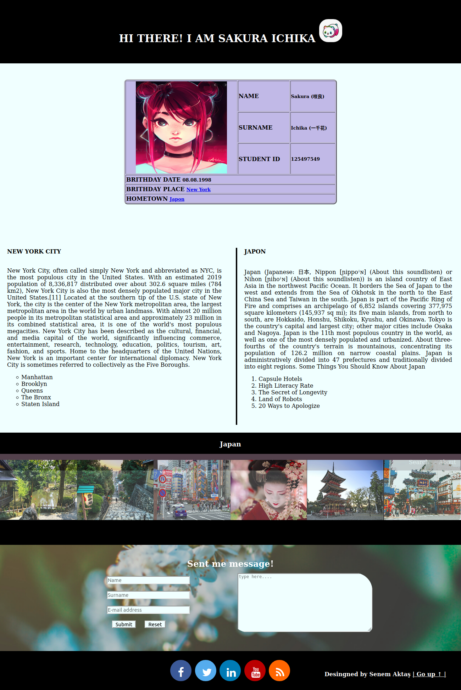
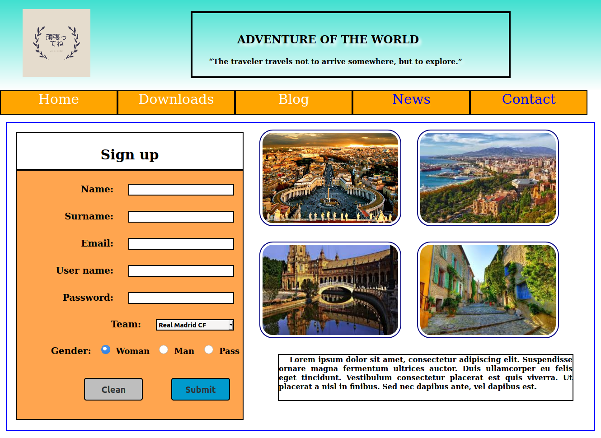

# web-frontend
There are various examples of web pages written in HTML, CSS, JS etc.

## Code Folder : RepresentationWithTable

  

## Code Folder : Registeration
 

- Heroku: Cloud Application Platform https://www.heroku.com/ 
- https://www.youtube.com/watch?v=Z1RJmh_OqeA
